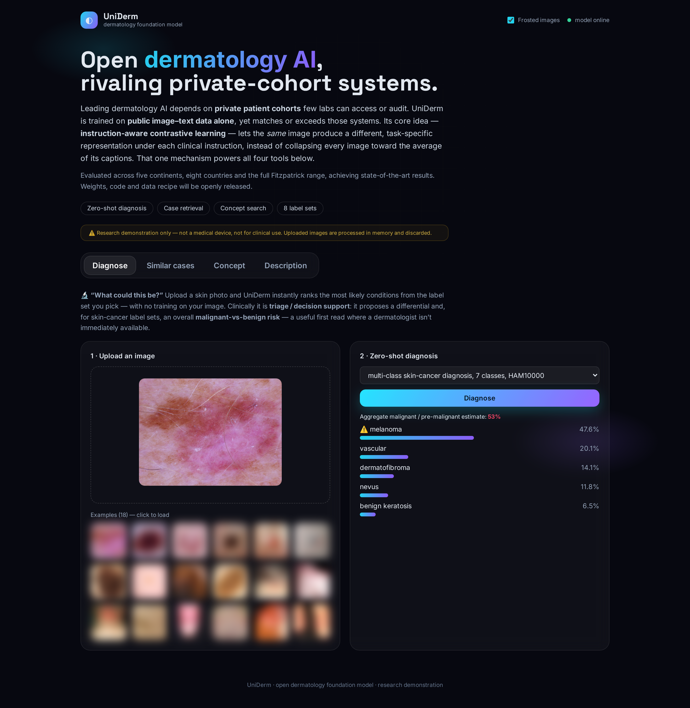

# UniDerm — Live Demo

**UniDerm** is an open **dermatology foundation model**. It maps skin images and clinical
text into one shared representation space through *instruction-aware contrastive learning*,
so a single model can handle several clinical tasks with **no task-specific retraining**.



## 🔗 Try the live demo

### → https://inform-dispatched-sounds-importance.trycloudflare.com

> ⚠️ **Research demonstration only — not a medical device, not for clinical use.** Uploaded
> images are processed in memory and discarded; nothing is stored.
>
> The link is a temporary preview and may change if the demo is restarted.

## For reviewers — accessing the code, model & data

The **access token** is provided in the paper. Use it to obtain the (gated) resources:

| Resource | Location |
|---|---|
| Code | https://github.com/Linwei-Chen/UniDerm |
| Model | https://huggingface.co/Linwei-Chen/UniDerm-model |
| Dataset | https://huggingface.co/datasets/Linwei-Chen/UniDerm-data |

**Hugging Face (model & dataset)** — with the token from the paper:

```bash
pip install -U huggingface_hub
export HF_TOKEN=<ACCESS_TOKEN_FROM_PAPER>
# model
huggingface-cli download Linwei-Chen/UniDerm-model --local-dir UniDerm-model
# dataset
huggingface-cli download Linwei-Chen/UniDerm-data --repo-type dataset --local-dir UniDerm-data
```

(Equivalently: `git clone https://user:<ACCESS_TOKEN_FROM_PAPER>@huggingface.co/Linwei-Chen/UniDerm-model`.)

**Code (GitHub)** — with the token from the paper:

```bash
git clone https://<ACCESS_TOKEN_FROM_PAPER>@github.com/Linwei-Chen/UniDerm.git
```

## What you can do in the demo

- **Diagnose** — upload a skin photo and get a zero-shot ranked differential over four
  clinical task families (multi-class skin-cancer diagnosis, binary melanoma detection,
  skin-condition diagnosis, rare-disease classification), plus a malignant-vs-benign estimate
  for the cancer label sets.
- **Similar cases** — retrieve the most visually similar, already-diagnosed images — a visual
  second opinion, with a neighbour vote.
- **Concept search** — pick a morphology concept (plaque, scale, ulcer, …) and see the images
  that show it.
- **Description search** — search images with plain clinical language: a body site, an
  appearance, or a disease name.

## About UniDerm

Leading dermatology AI depends on private patient cohorts that few labs can access or audit.
UniDerm is trained on **public image–text data alone**, yet reaches state-of-the-art results —
evaluated across five continents, eight countries and the full Fitzpatrick range. Its core
idea, *instruction-aware contrastive learning*, lets the same image yield a different,
task-specific representation under each clinical instruction. **Weights, code and the data
recipe will be released openly.**

---
Author: **Linwei Chen** · Research demonstration; not for clinical use.
